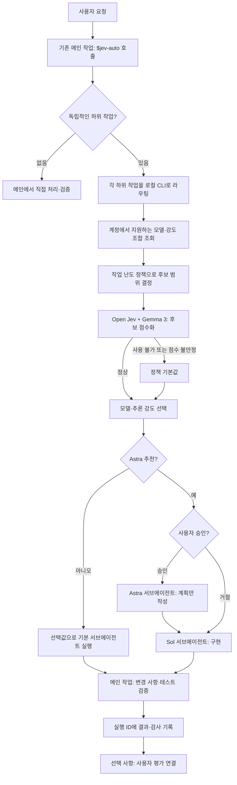
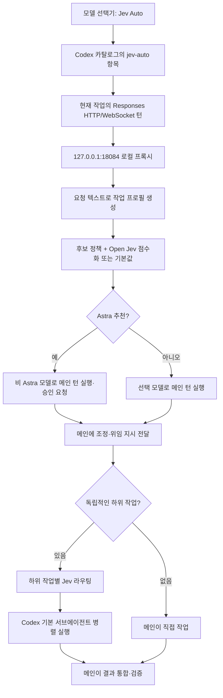
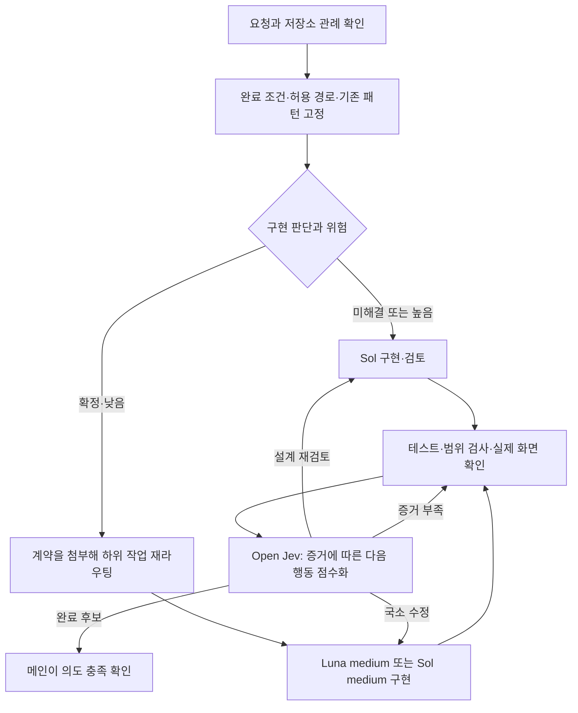

# codex-jev-auto

Jev Auto는 로컬 Open Jev로 Codex 작업에 사용할 모델과 추론 강도를 고른다. 후보는 GPT-6 Luna, GPT-5.6 Terra, GPT-6 Sol, GPT-6 Astra와 `low`·`medium`·`high`·`xhigh`·`max`의 최대 20개 조합이다. 실제 계정과 클라이언트가 지원하는 조합만 사용한다. `jev-auto`는 선택을 위한 가상 모델 이름이며, Open Jev와 Gemma 3는 코드를 작성하지 않고 후보에 점수를 매긴다.

## 동작 원리

메인 작업에서 `$jev-auto` 스킬을 호출하면 메인 작업의 모델과 대화는 유지된다. 독립적으로 나눌 수 있는 작업이 있으면 메인이 작업별로 모델을 골라 **Codex 기본 서브에이전트**에 맡기고 결과를 통합한다. 병렬로 실행할 수 있는 작업은 동시에 시작한다. 작거나 긴밀히 결합된 작업은 메인에서 처리한다. 별도 사용자 작업은 만들지 않는다.



모델 선택기에서 **Jev Auto**를 고르면 프록시가 메인 작업의 턴에 사용할 모델·추론 강도를 고른다. 또한 메인 에이전트에 조정 정책을 전달한다. 메인은 독립적인 하위 작업이 여러 개라고 판단하면 별도 스킬 호출 없이 각각 라우팅하고 기본 서브에이전트를 병렬 실행하도록 지시받는다. 프록시 자체가 에이전트를 생성하는 것은 아니며, 다른 구체 모델을 선택한 요청에는 조정 정책을 추가하지 않는다.



**Jev Auto 모델만 선택해도 메인 작업이 필요에 따라 서브에이전트를 위임하도록 지시**한다. 프록시는 작업 분류 결과만 전달할 수 있으며, 서브에이전트를 실제로 열지 여부는 메인 모델과 Codex 협업 도구가 결정한다. Astra가 추천되면 메인 턴은 비 Astra 모델로 실행된다. Astra 서브에이전트의 승인 확인과 계획 전용 역할은 현재 메인에 전달된 지시로 관리하며, 도구 호출 자체를 프록시가 기술적으로 차단하지는 못한다. 승인 전 Astra를 메인 모델로 보내지는 않는다. 실제 Desktop 자동 위임과 승인 흐름은 아직 검증되지 않았다.

같은 목표에 대한 반복 실패 신호가 있으면 Sol high가 먼저 이전 접근과 검증 근거를 검토한다. 새로운 계획이 도움이 될 때만 Astra 계획 검토를 제안하고 사용자 승인을 요청한다. 부정적인 실험 결과 하나로 Astra를 추천하거나 목표 달성을 약속하지 않는다. 프록시가 이전 대화를 받지 못한 턴에서는 메인 에이전트의 대화 검토가 이 판단을 보완한다.

## 단계별 구현과 의도 검토

메인은 코드 수정 전에 요청의 완료 조건과 저장소 관례를 짧은 작업 계약으로 정리한다. 분석에 Sol이 필요했더라도 구현 판단이 모두 끝났고 수정 범위가 작고 위험이 낮으면, 계약을 첨부한 후속 `route`에서 Luna medium을 후보에 넣는다. 명확하다는 문장만으로 난도를 내리지 않는다. 보안·동시성·마이그레이션 등은 이 경로에서 제외하며, 아주 작은 결합된 수정은 메인이 직접 처리할 수 있다.



계약은 임시 JSON 파일로 전달한다. `ui_baseline`에는 실제로 확인한 기존 컴포넌트나 화면 경로를 넣는다. 일반 코드 작업에는 생략할 수 있다.

```json
{
  "requirement": "회원 저장 버튼이 기존 화면과 같은 형태로 동작한다",
  "allowed_paths": ["src/member/MemberForm.tsx"],
  "acceptance_checks": ["submit_works", "button_matches_existing"],
  "existing_patterns": ["기존 PrimaryButton을 재사용"],
  "decisions_resolved": true,
  "risk": "low",
  "ui_baseline": ["src/components/PrimaryButton.tsx"]
}
```

```sh
jev-auto route '회원 폼 버튼 구현' --workspace /absolute/repo/path --contract-file /tmp/jev-contract.json
jev-auto quality-check '회원 폼 버튼 구현' --workspace /absolute/repo/path --allowed-path 'src/member/MemberForm.tsx'
jev-auto intent-review --contract-file /tmp/jev-contract.json --evidence-file /tmp/jev-evidence.json
```

마지막 명령의 증거 JSON에는 `acceptance_results`(계약의 검사 ID와 `passed|failed|missing`), `tests`(실행한 검사명과 상태), `quality`(`quality-check`의 전체 JSON 출력)를 넣는다. UI가 바뀌었다면 `visual_review`에 상태와 함께 `baseline_ref`(비교한 기존 화면·컴포넌트), `rendered_ref`(실제 렌더링 결과), `comparison_notes`(형태·간격·상태 비교 결과)를 적는다. 검토 결과는 `complete_candidate`, `luna_fix`, `sol_review`, `evidence_missing` 중 하나다. 실패·누락된 필수 증거나 해결하지 않은 검사 항목이 있으면 완료 후보가 될 수 없다. Open Jev의 선택은 다음 행동에 대한 조언이며, 메인이 실제 diff와 화면을 보고 최종 완료 여부를 판단한다. 정적 검사는 버튼의 시각적 일관성을 완전히 증명하지 못한다.

## 설치

Python 3.11+, `uv`, Codex 로그인이 필요하다. Open Jev 점수화를 쓰려면 로컬 Open Jev와 Gemma 3 4B 가중치를 준비한다. 기존 설치 기본 경로는 `~/.local/share/jev-router/open-jev`이고 Open Jev 주소는 `http://127.0.0.1:8000`이다. 준비되지 않으면 정책에 따른 비 Astra 기본 설정을 사용한다.

```sh
cd plugins/jev-router
uv sync
uv run pytest -q
uv run jev-auto install
codex plugin add jev-router@personal
```

`install`은 설치된 Codex 모델 목록을 보존하면서 `Jev Auto` 항목을 더한 카탈로그를 만든다. 로컬 서버를 macOS LaunchAgent로 시작하고 `~/.codex/config.toml`에 `model_catalog_json`과 `openai_base_url`을 추가한다. 기존 설정 백업은 `~/.local/share/jev-router`에 보관한다. Codex Desktop은 카탈로그 갱신을 반영하려면 다시 열어야 할 수 있으며, 이미 열려 있던 작업의 새 플러그인 스킬 로딩은 보장되지 않는다. 모델 선택기의 사용자 인터페이스 지원 여부는 설치된 Desktop 빌드에서 확인해야 한다.

```sh
# 상태 확인
curl http://127.0.0.1:18084/healthz
codex debug models
~/.local/share/jev-router/bin/jev-auto doctor

# 메인 작업에서 사용할 서브에이전트 모델 사전 선택
~/.local/share/jev-router/bin/jev-auto route '요청 내용' --workspace /absolute/repo/path

# 실행 결과와 사후 피드백
~/.local/share/jev-router/bin/jev-auto finish RUN_ID --status completed --agent gpt-6-sol medium AGENT_ID --check 'pytest: 24 passed'
~/.local/share/jev-router/bin/jev-auto feedback RUN_ID --rating mixed --note '동작하지만 코드가 복잡함'
~/.local/share/jev-router/bin/jev-auto runs --limit 10

# 모델 선택기의 Jev Auto 메인 턴: 선택·사용량 조회와 작업 결과 연결
~/.local/share/jev-router/bin/jev-auto auto-runs --limit 10
~/.local/share/jev-router/bin/jev-auto auto-outcome ROUTE_KEY --status completed --check '테스트 통과' --revisions 1
~/.local/share/jev-router/bin/jev-auto auto-feedback ROUTE_KEY --rating mixed --note '기능은 맞지만 수정 범위가 큼'

# 코드·화면 작업 전 저장소 관례 확인, 작업 후 변경 범위와 관례 검사
~/.local/share/jev-router/bin/jev-auto quality-context '검색 조건 추가' --workspace /absolute/repo/path --focus-path 'src/main/java/example/search/' --save-baseline
~/.local/share/jev-router/bin/jev-auto quality-check '검색 조건 추가' --workspace /absolute/repo/path --baseline-id BASELINE_ID --allowed-path 'src/main/' --allowed-path 'src/test/' --run-id ROUTED_RUN_ID
# 모델 선택기 경로에서는 --run-id 대신 --route-key ROUTE_KEY 사용

# 카탈로그 갱신 / 설정 복원
uv run jev-auto sync-catalog
uv run jev-auto restore
```

### GPT-6 Sol/Luna 사용 범위

| Jev Auto 진입 경로 | Sol/Luna 후보 | 확인 상태 |
| --- | --- | --- |
| Codex CLI 0.157의 `codex exec -m jev-auto` | 포함 | Sol/Luna 직접 호출과 Jev Auto가 각각으로 라우팅한 호출이 모두 성공했다. |
| 구버전 CLI의 `codex_exec` 요청 | 제외 | 0.154에서 두 모델의 직접 호출이 거절됐다. 라우터는 0.156 미만 CLI에 보수적으로 Terra/Astra 후보만 허용한다. Astra가 추천되면 Terra 메인 턴에서 승인을 묻는다. |
| Codex Desktop의 `$jev-auto` 스킬 | 포함 | 기본 서브에이전트에 선택값을 전달한다. Luna 서브에이전트의 간단한 실행은 확인했다. |
| Codex Desktop 모델 선택기의 `Jev Auto` | 포함 | CLI 제한을 적용하지 않는다. Desktop에서 Sol/Luna를 선택한 턴의 백엔드 성공 여부는 아직 확인하지 않았다. |

따라서 **현재 설치된 CLI 0.157의 Jev Auto에서는 GPT-6 Sol/Luna를 사용할 수 있다.** 모델 카탈로그에 보이는 것과 실제 백엔드 호출 성공은 구분해야 한다. 다른 구체 모델을 직접 선택한 요청은 프록시가 모델을 바꾸지 않고 전달한다.

## 동작과 범위

프록시는 `127.0.0.1:18084`에서 Responses HTTP/WebSocket 요청을 받아, `jev-auto`일 때만 모델·추론 강도를 바꾼다. 기존 Codex 로그인 헤더를 상위 서버로 전달한다. 요청 본문과 인증 토큰은 라우팅 로그에 저장하지 않는다. 선택 결과는 `auto-decisions.jsonl`, 메인 턴의 완료 상태와 확인 가능한 토큰 사용량은 `auto-usage.jsonl`에 route key로 남는다. `auto-outcome`과 `auto-feedback`으로 검사 결과·수정 횟수·명시적 사용자 평가를 같은 key에 연결할 수 있다. 사용량이 응답에 없으면 0으로 채우지 않고 미상으로 표시한다. 서브에이전트별 CLI `route`는 별도 실행 ID를 반환하며, `runs/`에 실제 실행 모델·에이전트 ID·작업 전후 Git 상태·검사·선택적 사용자 평가를 저장한다. 품질 판단은 여전히 테스트·diff·화면 확인이 필요하고 Open Jev 점수는 성공률이 아니다.

`doctor`는 설치 설정, 카탈로그 파일, 로컬 서비스, Codex CLI에서 `jev-auto`가 조회되는지를 확인한다. Desktop 선택기 표시와 실제 Desktop 턴의 백엔드 호출은 이 명령으로 증명할 수 없으므로 `unverified`로 표시한다.

라우팅과 실행 연결에 더해 저장소 관례를 확인하는 품질 검사 명령을 제공한다. Jev Auto 스킬과 카탈로그 모델의 메인 지시는 코드·UI 작업 전에 `quality-context --save-baseline`, 작업 후에 `quality-check --baseline-id`를 호출하도록 안내한다. 기준선에는 작업 전 변경 파일 경로와 해시만 저장하며, 그대로인 사전 변경은 검사에서 제외한다. 사전 수정 파일을 다시 바꾸면 별도 수동 검토 대상으로 표시한다. `--focus-path`로 대상 주변의 React 및 KMP/CMP Compose 화면 관례를 조사할 수 있다. 화면 작업에서는 기존 테마·컴포넌트·상태 처리와 시각적 위계를 먼저 정리하고, 변경 후 실제 렌더링과 해당 플랫폼의 화면 상태를 확인한다. 정적 검사에서 발견한 디자인 토큰·상태·성능 위험은 검토 신호이며, 실제 디자인 품질이나 성능 측정값이 아니다. JPA와 QueryDSL 사용 근거가 함께 발견된 저장소에서는 새 직접 JDBC 코드를 경고한다. 예외를 선택할 때는 `--allow-jdbc --jdbc-reason '구체적 사유'`가 필요하다. 계획한 경로 밖의 수정도 검토 대상으로 표시한다. `--run-id` 또는 `--route-key`로 해당 실행 기록에 검사 건수와 종류를 연결한다. 요청 문장과 소스 줄은 기록하지 않는다. 자세한 경계와 예시는 [실행 구조](docs/jev-auto-architecture.md)를 참고한다. 과거 MCP 시제품의 검증은 [1차 검증 기록](docs/phase1-verification.md)에 남겨 두었다.
