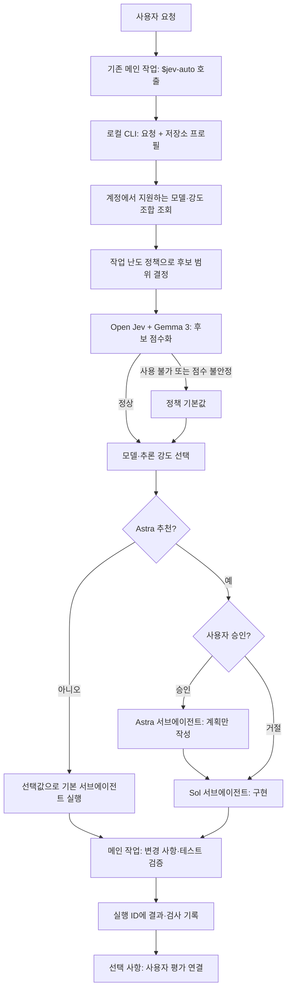
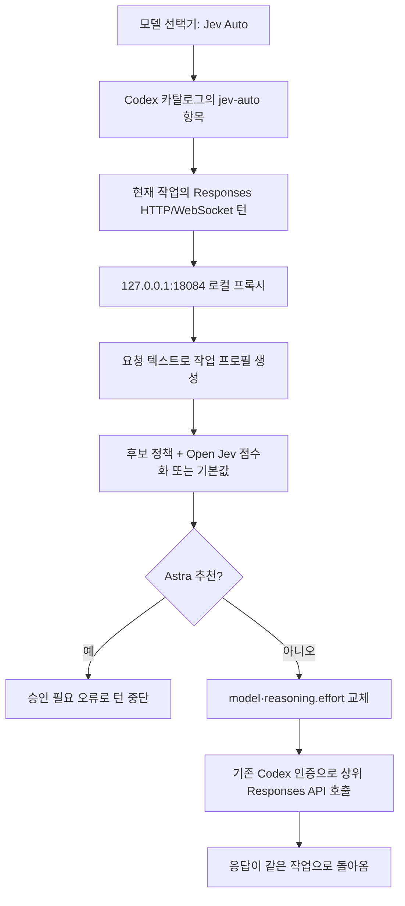

# codex-jev-auto

Jev Auto는 로컬 Open Jev로 Codex 작업에 사용할 모델과 추론 강도를 고른다. 후보는 GPT-6 Luna, GPT-5.6 Terra, GPT-6 Sol, GPT-6 Astra와 `low`·`medium`·`high`·`xhigh`·`max`의 최대 20개 조합이다. 실제 계정과 클라이언트가 지원하는 조합만 사용한다. `jev-auto`는 선택을 위한 가상 모델 이름이며, Open Jev와 Gemma 3는 코드를 작성하지 않고 후보에 점수를 매긴다.

## 동작 원리

메인 작업에서 `$jev-auto` 스킬을 호출하면 메인 작업의 모델과 대화는 유지된다. 스킬은 사용자 요청과 저장소의 간단한 프로필을 로컬 CLI에 전달한다. 라우터는 사용 가능한 조합을 조회하고 작업 난도에 따른 후보 범위를 정한 뒤, Open Jev의 순위를 사용해 모델과 추론 강도를 고른다. Open Jev가 준비되지 않았거나 점수가 불안정하면 정책 기본값을 사용한다. 메인 작업은 선택값으로 **Codex 기본 서브에이전트**를 실행하고 결과를 검증한다. 별도 사용자 작업은 만들지 않는다.



모델 선택기에서 **Jev Auto**를 직접 고르면 현재 작업의 턴 자체가 라우팅된다. 설치기가 추가한 `model_catalog_json` 항목을 Codex가 읽고, `openai_base_url`로 연결한 로컬 Responses 프록시가 `jev-auto` 요청의 `model`과 `reasoning.effort`를 실제 선택값으로 바꿔 상위 API에 전달한다. 다른 구체 모델을 선택한 요청은 모델을 바꾸지 않고 통과한다. 이 경로는 서브에이전트를 자동 생성하지 않는다.



메인 작업을 조정자로 유지하고 구현 모델만 바꾸려면 **`$jev-auto` 스킬 경로**를 사용한다. Astra 추천은 항상 실행 전에 사용자 확인을 받는다. 모델 선택기의 직접 라우팅은 Astra 추천 시 차단하므로, 승인 후 Astra 계획과 Sol 구현을 이어 가려면 스킬 경로를 사용한다. 기본 서브에이전트의 파일 쓰기를 기술적으로 막는 옵션은 없어 Astra의 계획 전용 범위는 지시와 메인 작업의 변경 상태 점검으로 확인한다.

## 설치

Python 3.11+, `uv`, Codex 로그인이 필요하다. Open Jev 점수화를 쓰려면 로컬 Open Jev와 Gemma 3 4B 가중치를 준비한다. 기존 설치 기본 경로는 `~/.local/share/jev-router/open-jev`이고 Open Jev 주소는 `http://127.0.0.1:8000`이다. 준비되지 않으면 정책에 따른 비 Astra 기본 설정을 사용한다.

```sh
cd plugins/jev-router
uv sync
uv run pytest -q
uv run jev-auto install
codex plugin add jev-router@personal
```

`install`은 설치된 Codex 모델 목록을 보존하면서 `Jev Auto` 항목을 더한 카탈로그를 만든다. 로컬 서버를 macOS LaunchAgent로 시작하고 `~/.codex/config.toml`에 `model_catalog_json`과 `openai_base_url`을 추가한다. 기존 설정 백업은 `~/.local/share/jev-router`에 보관한다. Codex Desktop은 카탈로그 갱신을 반영하려면 다시 열어야 할 수 있으며, 이미 열려 있던 작업의 새 플러그인 스킬 로딩은 보장되지 않는다. 모델 선택기의 사용자 인터페이스 지원 여부는 설치된 Desktop 빌드에서 확인해야 한다.

```sh
# 상태 확인
curl http://127.0.0.1:18084/healthz
codex debug models
~/.local/share/jev-router/bin/jev-auto doctor

# 메인 작업에서 사용할 서브에이전트 모델 사전 선택
~/.local/share/jev-router/bin/jev-auto route '요청 내용' --workspace /absolute/repo/path

# 실행 결과와 사후 피드백
~/.local/share/jev-router/bin/jev-auto finish RUN_ID --status completed --agent gpt-6-sol medium AGENT_ID --check 'pytest: 24 passed'
~/.local/share/jev-router/bin/jev-auto feedback RUN_ID --rating mixed --note '동작하지만 코드가 복잡함'
~/.local/share/jev-router/bin/jev-auto runs --limit 10

# 카탈로그 갱신 / 설정 복원
uv run jev-auto sync-catalog
uv run jev-auto restore
```

### GPT-6 Sol/Luna 사용 범위

| Jev Auto 진입 경로 | Sol/Luna 후보 | 확인 상태 |
| --- | --- | --- |
| Codex CLI 0.157의 `codex exec -m jev-auto` | 포함 | Sol/Luna 직접 호출과 Jev Auto가 각각으로 라우팅한 호출이 모두 성공했다. |
| 구버전 CLI의 `codex_exec` 요청 | 제외 | 0.154에서 두 모델의 직접 호출이 거절됐다. 라우터는 0.156 미만 CLI에 보수적으로 Terra/Astra 후보만 허용한다. Astra는 별도 승인 전 차단된다. |
| Codex Desktop의 `$jev-auto` 스킬 | 포함 | 기본 서브에이전트에 선택값을 전달한다. Luna 서브에이전트의 간단한 실행은 확인했다. |
| Codex Desktop 모델 선택기의 `Jev Auto` | 포함 | CLI 제한을 적용하지 않는다. Desktop에서 Sol/Luna를 선택한 턴의 백엔드 성공 여부는 아직 확인하지 않았다. |

따라서 **현재 설치된 CLI 0.157의 Jev Auto에서는 GPT-6 Sol/Luna를 사용할 수 있다.** 모델 카탈로그에 보이는 것과 실제 백엔드 호출 성공은 구분해야 한다. 다른 구체 모델을 직접 선택한 요청은 프록시가 모델을 바꾸지 않고 전달한다.

## 동작과 범위

프록시는 `127.0.0.1:18084`에서 Responses HTTP/WebSocket 요청을 받아, `jev-auto`일 때만 모델·추론 강도를 바꾼다. 기존 Codex 로그인 헤더를 상위 서버로 전달한다. 요청 본문과 인증 토큰은 라우팅 로그에 저장하지 않는다. 선택 결과는 `~/.local/share/jev-router/auto-decisions.jsonl`에 모델·강도·정책 근거로 남는다. 스킬 경로는 `route`가 반환한 실행 ID를 기준으로 `~/.local/share/jev-router/runs/`에 선택·실제로 실행한 서브에이전트 모델과 ID·작업 전후 Git 상태·확인한 검사·선택적 사용자 평가를 이어 저장한다. Git 상태만으로 변경의 품질을 판정하지 않으며, 사용자 평가는 객관적 검증과 구분한다. 모델 선택기 프록시 경로는 현재 선택 기록만 남기고 코드 품질 결과까지 자동으로 연결하지 않는다. Open Jev 점수는 상대적인 옵션 순위이며 실제 성공률이 아니다.

`doctor`는 설치 설정, 카탈로그 파일, 로컬 서비스, Codex CLI에서 `jev-auto`가 조회되는지를 확인한다. Desktop 선택기 표시와 실제 Desktop 턴의 백엔드 호출은 이 명령으로 증명할 수 없으므로 `unverified`로 표시한다.

1차 범위는 라우팅과 실행 연결이다. 쉬운 백엔드 작업은 단순하게, 어려운 작업에는 필요한 구조를 충분히 적용하는 코드 품질 루프와 정돈된 프론트엔드 코드·더 나은 화면 디자인 평가 루프는 [개발 계획](docs/plan.md)의 다음 단계다. 과거 MCP 시제품의 검증은 [1차 검증 기록](docs/phase1-verification.md)에 남겨 두었다.
